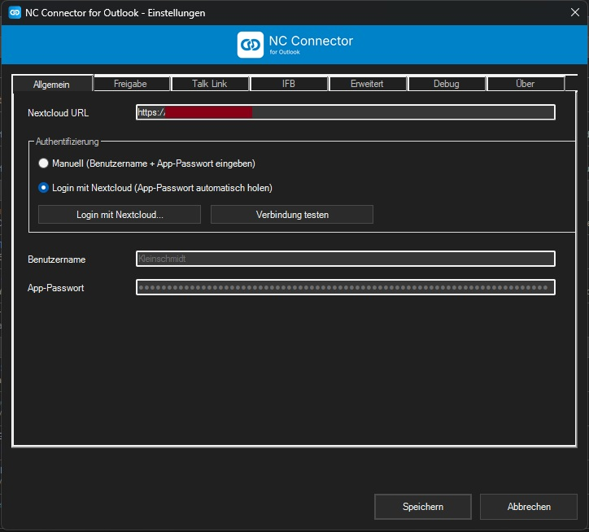
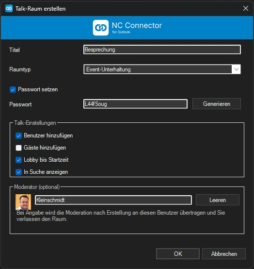
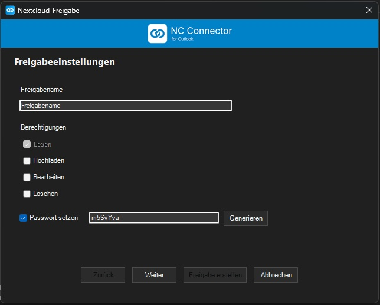
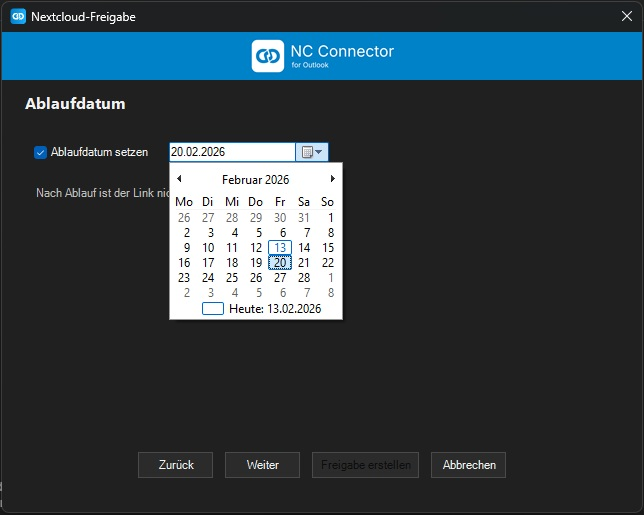
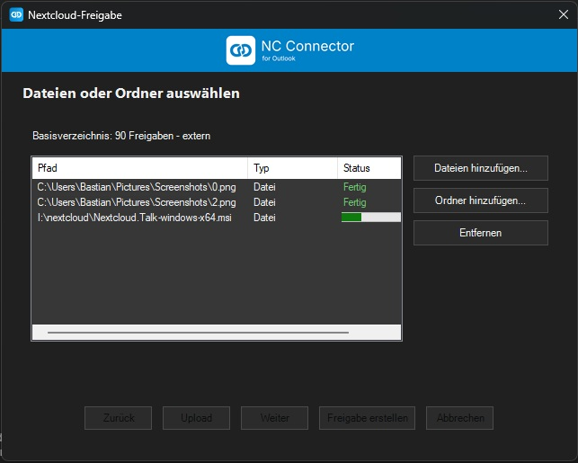
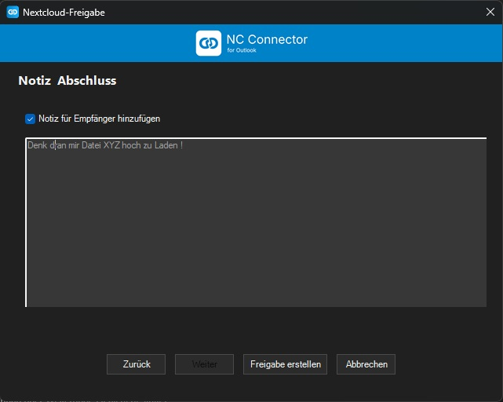
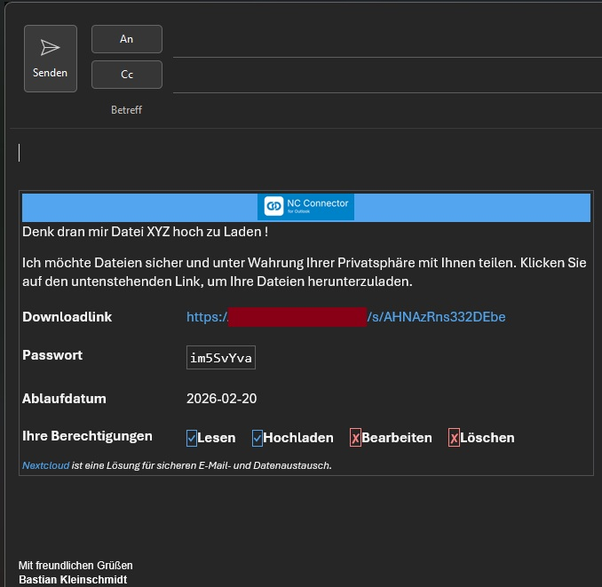
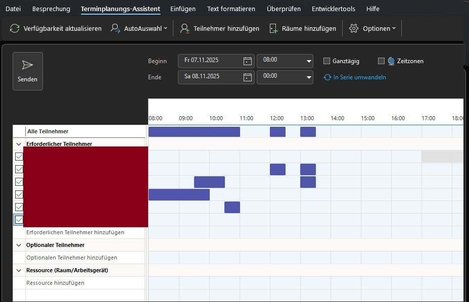

[English](https://github.com/nc-connector/NC_Connector_for_Outlook/blob/main/README.md) | [Deutsch](https://github.com/nc-connector/NC_Connector_for_Outlook/blob/main/README.de.md)
[Admin Guide](https://github.com/nc-connector/NC_Connector_for_Outlook/blob/main/docs/ADMIN.md) | [Development Guide](https://github.com/nc-connector/NC_Connector_for_Outlook/blob/main/docs/DEVELOPMENT.md) | [Translations](https://github.com/nc-connector/NC_Connector_for_Outlook/blob/main/Translations.md) | [VENDOR](https://github.com/nc-connector/NC_Connector_for_Outlook/blob/main/VENDOR.md)

# NC Connector for Outlook

NC Connector for Outlook connects Outlook seamlessly with your Nextcloud. The add-in automates Talk rooms for appointments, provides a local free/busy proxy, and ships a powerful filelink wizard for emails. The goal is a professional workflow from calendar to file storage — without context switching and with clear admin controls.

This is a community project and is not an official Nextcloud GmbH product.

## Highlights

- **One-click Nextcloud Talk**  
Open an appointment, choose Nextcloud Talk, configure the room, and select a moderator. Optionally, invited attendees can be added to the room automatically (separately for internal Nextcloud users and external email guests). The wizard writes title, location, and a description block (including help link) into the appointment.
- **Sharing deluxe**  
The compose button “Insert Nextcloud share” starts the sharing wizard with upload queue, password generator, expiration date, note field, attachment automation, and optional separate password follow-up mail. The finished share is inserted as formatted HTML directly into the email.
- **Enterprise-grade security**  
Lobby until start time, moderator delegation, automatic cleanup of discarded appointments, mandatory passwords, and expiration policies help protect sensitive meetings and files.
- **Central backend policies (optional)**  
If the optional NC Connector backend is installed, Talk and Sharing defaults can be controlled centrally. On wizard open and in Settings, the add-in checks the backend status, applies valid seat policies, and locks admin-controlled options while still showing their effective values.
- **Internet Free/Busy Gateway (IFB)**  
A local HTTP listener answers Outlook free/busy requests directly from Nextcloud. The installer configures registry values for search path and read URL. If the direct fetch returns HTTP 404, the add-in falls back to a scheduling POST so availability data is still provided.
- **Debug logging at the press of a button**  
Enable it in the Debug tab. Writes structured logs (authentication, appointment and filelink flows, IFB) to `%LOCALAPPDATA%\NC4OL\addin-runtime.log_YYYYMMDD`. Runtime exceptions are still written there even when the debug switch is off. The path is displayed in the UI. A new `Anonymize logs` option (default: enabled) masks NC URL, tokens/secrets, emails, and local user path fragments.

## Changelog

See [`CHANGELOG.md`](https://github.com/nc-connector/NC_Connector_for_Outlook/blob/main/CHANGELOG.md).

## Third-party licenses

Bundled third-party sanitizer/runtime dependencies and their licenses are documented in [`VENDOR.md`](https://github.com/nc-connector/NC_Connector_for_Outlook/blob/main/VENDOR.md).

## Feature overview

### Nextcloud Talk directly from the appointment
- Talk dialog with lobby, password, listable scope, room type, and moderator search.
- Automatically writes title, location and a description block (incl. help link and password) into the appointment.
- Room tracking, lobby updates, delegation workflow, and cleanup when an appointment is discarded or moved.
- Calendar changes (drag & drop or dialog edits) keep the Talk room lobby/start time in sync.
- If moderator delegation is enabled, NC Connector first updates room name, lobby time, description, and participants when you save the appointment, then hands moderation over.
- Live system-addressbook availability checks (on Talk click, settings open/save, wizard open) with deterministic lock behavior:
  - `Add users`, `Add guests`, and moderator controls are disabled when unavailable.
  - Settings show a red warning block with setup guide link.
  - Talk wizard shows an inline red warning block in the moderator section.
- Optional participant sync after saving the appointment:
  - **Users:** internal Nextcloud users are added to the room.
  - **Guests:** external email addresses are invited as guests (Nextcloud may also send an additional invitation email).

### Nextcloud Sharing in the compose window
- Four steps (share, expiration date, files, note) with a password-protected upload folder.
- Upload queue with duplicate checks, progress display and optional share creation.
- Automatic HTML block with link, password, expiration date and optional note.
- Optional compose attachment automation:
  - always route new attachments into NC Connector, or
  - prompt above a configurable total-size threshold.
- Compose attachment automation now runs a pre-add check (`BeforeAttachmentAdd`) and can best-effort cancel host add operations before Outlook post-add handling, when a resolvable local file path is available.
- Threshold prompt uses exactly two actions:
  - `Share with NC Connector`
  - `Remove last selected attachments` (batch-aware, not single-file only).
- Attachment-mode specifics:
  - fixed share base name `email_attachment` with deterministic suffixes (`_1`, `_2`, ...)
  - recipient permission is always read-only
  - HTML output uses ZIP download URL `/s/<token>/download` and hides the permissions row.
- File queue input now accepts Explorer drag & drop for files and folders across the full file step (queue and action area), not only through the add buttons.
- Optional separate password-mail flow:
  - requires the optional NC Connector backend plus an active seat assigned to the current user
  - hide inline password in main HTML block
  - send password in a follow-up email after successful primary send
  - fallback to a prefilled manual draft if auto-send fails.

### Administration & compliance
- Login Flow V2 (app password is created automatically) and central options (base URL, debug mode, sharing paths, defaults for Sharing/Talk).
- Optional NC Connector backend status/policy contract:
  - checked on Talk wizard open, Sharing wizard open, and Settings open/save
  - valid active seat enables backend policy values and admin locks
- missing backend / no seat / invalid seat / expired grace time falls back to local settings
  - invalid seat states remain visible in the UI so users can contact their administrator
- backend share/Talk templates are only activated when the language override is set to `Custom`
- `Custom` is only shown when the NC Connector backend endpoint exists and stays disabled unless the effective backend policy for that domain is actually `custom` and provides a template
- if `Custom` is selected but the backend template is empty or unavailable, Outlook falls back to the local UI-default text block
- Full localization (see [`Translations.md`](https://github.com/nc-connector/NC_Connector_for_Outlook/blob/main/Translations.md)) and structured debug logs for support cases.

## Language & translations

- The UI language follows the Outlook/Office UI language. If Outlook is set to **Use system settings**, this usually matches the Windows display language.
- Supported languages are documented in [`Translations.md`](https://github.com/nc-connector/NC_Connector_for_Outlook/blob/main/Translations.md). Fallback is `de`, then `en`.

### Language overrides (text blocks)

In Settings under **Advanced**, you can choose the language for inserted text blocks independently of the UI language:

- **Sharing HTML block** (email): language of the formatted HTML block inserted when sharing.
- **Talk description text** (appointment): language of the inserted text (e.g., password line / help link).

Option `Default (UI)` uses the current UI language (including fallbacks).

Option `Custom` is only shown when the NC Connector backend endpoint exists. It becomes selectable only when the effective backend policy for the respective domain is actually `custom` and a backend template is present. Otherwise it stays disabled and Outlook keeps using the local UI-default block.

## System requirements

- Windows 10 or Windows 11 (64-bit)  
- Microsoft Outlook classic >= 2019  
- .NET Framework 4.7.2 Runtime  
- Nextcloud Server with Talk and Files Sharing apps

## Installation and updates

1. Close Outlook.  
2. Run the latest MSI (for example `NCConnectorForOutlook-3.0.2.msi`) and confirm the UAC prompt (administrator rights are required). The setup configures URLACL and all required registry keys for IFB.  
3. Start Outlook and click **NC Connector → Settings** in the ribbon.  
4. Choose the login mode, run the connection test, and save. If the test succeeds, IFB is active automatically.  
5. Verify the filelink base directory and enable debug logging if needed.

Updates are applied by installing a MSI package over the existing installation (same, older, or newer version). Personal settings are kept and migrated to profile-based XML files (`settings_<OutlookProfile>.xml`) under `%LOCALAPPDATA%\NC4OL`. Uninstall removes the add-in, stops the IFB listener, and resets the registry values.

### Release 3.0.2 operational notes

- Runtime artifacts are consolidated in `%LOCALAPPDATA%\NC4OL`:
  - settings files (`settings_<OutlookProfile>.xml`)
  - IFB/system-addressbook cache
  - daily debug logs (`addin-runtime.log_YYYYMMDD`, keep latest 7 and remove >30 days best effort)
- Legacy INI settings from older builds are migrated on first start and removed after successful migration.
- TLS mode can be switched live in Settings (`OS default`, `TLS 1.2`, `TLS 1.3`, or `TLS 1.2 + 1.3`) and is applied immediately to runtime networking.
- Settings connectivity operations (connection test and login flow) now force a fresh HTTP/TLS handshake, so TLS-mode checks are deterministic and not masked by pooled keep-alive sockets.
- Attachment-mode compose shares arm server-side cleanup immediately after share creation and clear cleanup only after confirmed successful mail send.
- If separate password mail is enabled, the main mail hides inline password information and password follow-up dispatch is triggered only after confirmed successful primary send. This feature is only available with backend endpoint + active assigned seat.

## Troubleshooting

- **Debug log**: enable it in the *Debug* tab for verbose traces. Log file format: `%LOCALAPPDATA%\NC4OL\addin-runtime.log_YYYYMMDD`. With debug enabled, attachment pre-add decisions/fallback reasons are included. Runtime exceptions are written there even when debug logging is disabled. The `Anonymize logs` switch is enabled by default.  
- **Add-in not visible**: installation must be run with admin rights. Check `HKLM\Software\Microsoft\Office\Outlook\Addins\NcTalkOutlook.AddIn` and optionally run a repair from an elevated prompt: `msiexec /i "NCConnectorForOutlook-3.0.2.msi" ADDLOCAL=ALL`.  
- **Test IFB**: `powershell -Command "Invoke-WebRequest http://127.0.0.1:7777/nc-ifb/freebusy/<mail>.vfb -UseBasicParsing"`. If behavior differs, verify the registry under `HKCU\Software\Microsoft\Office\<Version>\Outlook\Options\Calendar`.  
- **Check TLS/proxy**: `powershell -Command "Test-NetConnection <your-domain> -Port 443"`. If you see SSL warnings, verify certificates/proxy settings. You can switch TLS mode at runtime in `Settings -> Advanced -> Transport security (TLS)` (`OS default` or forced TLS versions like 1.2/1.3). Connection test/login flow use fresh handshakes in 3.0.2, so TLS mode changes are evaluated directly. If secure-channel errors still occur, check certificate trust, TLS-inspecting proxies, DNS, and machine TLS/Schannel policy before considering machine-wide registry/GPO overrides.  
- **Attachment automation does not trigger for large files**: In Microsoft 365 / Exchange environments, Outlook can block attachments before add-in events fire (for example due to server-side size limits). In those cases, use the **`Insert Nextcloud share`** button.  
- **Sharing errors**: the debug log includes HTTP status codes and exception details. Required wizard fields are validated.

## Screenshots

<strong>Settings</strong>

|  |
| --- |

<strong>Talk link workflow</strong>

|  |  |
| --- | --- |

<strong>Sharing wizard</strong>

|  |  |
| --- | --- |
|  |  |
|  | |

<strong>Internet Free/Busy</strong>

|  |
| --- |

